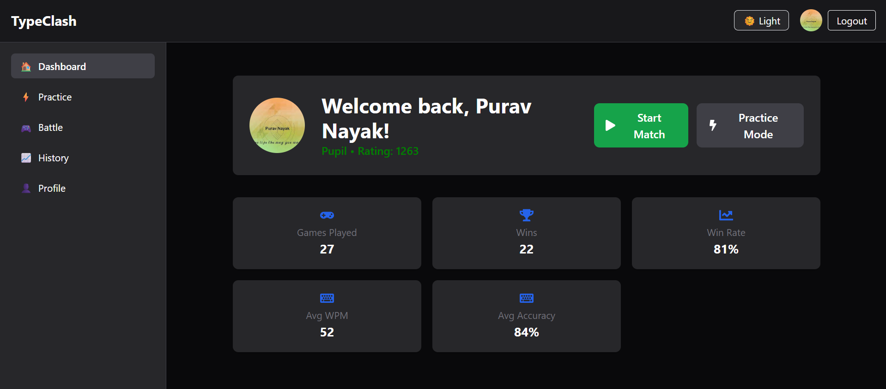
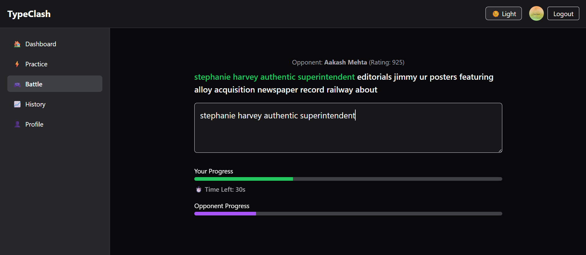

# TypeClash ⚔️ ⌨️

TypeClash is a real-time 1v1 typing battle platform inspired by Chess.com, built with the MERN stack and Socket.IO. It allows players to match with others, compete in live typing battles, track performance, and improve with AI-powered tips.

## 🔥 Features

- 🔁 Real-time matchmaking with rank-based ELO system
- 🆚 Live 1v1 typing battles with opponent progress tracking
- 📈 Post-match rating updates and battle analytics (WPM, Accuracy, Errors)
- 🧠 AI-powered personalized improvement tips (via Together AI)
- 👤 Profile pages with match history and stats
- 🧪 Practice mode with custom length and time
- 🛡️ Anti-cheat mechanisms (basic, optional)
- 🎨 Clean, responsive UI (React + Tailwind)

## 🖥️ Tech Stack

- **Frontend**: React, Tailwind CSS, Socket.IO Client
- **Backend**: Node.js, Express, Socket.IO, MongoDB, Mongoose
- **AI Tips**: Together AI (Mistral-7B)
- **Auth**: Firebase Authentication with Google Sign-In
- **Deployment**: [coming soon]

## 🚀 Getting Started

### 1. Clone the repo

```bash
git clone https://github.com/your-username/TypeClash.git
cd TypeClash
```
### 2. Set up environment variables
Create two .env files:

#### A. Backend (/server/.env)
```bash
MONGO_URI=your_mongodb_uri
TOGETHER_API_KEY=your_together_ai_key
CLIENT_ORIGIN=http://localhost:5173
PORT=3000
```
#### B. Frontend (/client/.env)

```bash
VITE_FIREBASE_API_KEY=...
VITE_FIREBASE_AUTH_DOMAIN=...
VITE_FIREBASE_PROJECT_ID=...
VITE_FIREBASE_APP_ID=...
VITE_BACKEND_URL=http://localhost:3000
```

### 3. Install dependencies
#### A. Backend 
```bash
cd server
npm install
```
#### B. Frontend 

```bash
cd ../client
npm install
```

### 4. Run the app locally

```bash
# In one terminal tab
cd server
npm run dev

# In another tab
cd client
npm run dev
```
Visit http://localhost:5173 to try it!

## Screenshots
## 📸 Screenshots





---

## 🚀 Future Plans & Ideas

Here are some upcoming features and improvements planned for **TypeClash**:

### 🔧 Gameplay & Experience
- [ ] **AI Battle Mode** – Practice against an AI opponent with adaptive difficulty.
- [ ] **Multiplayer with Friends** – Invite and play with friends using private lobbies.
- [ ] **Custom Game Settings** – Set your own time, word list, and difficulty.

### 📊 Analytics & Feedback
- [ ] **Performance Insights** – Deeper breakdowns of typing behavior (e.g., slowest keys, most mistyped letters).
- [ ] **Progress Graphs** – Track rating, WPM, and accuracy over time.

### 🏆 Competitive Features
- [ ] **Daily/Weekly Leaderboards** – Rankings for top players each day/week.
- [ ] **Achievements & Badges** – Earn rewards for consistency and milestones.

### 🛡️ Anti-Cheat
- [ ] **Keystroke Pattern Detection** – Identify automated typing or suspicious behavior.
- [ ] **Inactivity & Focus Loss Detection** – Penalties for tab switching during ranked games.

### 🖼️ UI & UX
- [ ] **Mobile Friendly UI** – Optimize for touch input and smaller screens.
- [ ] **Dark Mode Toggle** – Seamless theme switching for comfort.
